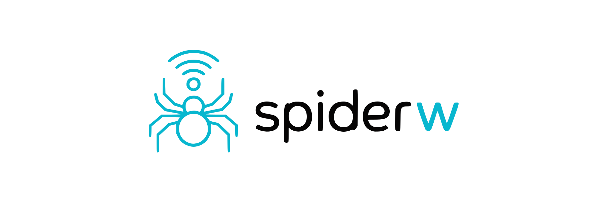

<p align="center">
  <picture>
    <source media="(prefers-color-scheme: dark)" srcset="docs/assets/spiderw-lockup-dark.svg">
    
  </picture>
</p>

[](https://github.com/chrispypip/spiderw/actions/workflows/ci.yml)
[](https://scorecard.dev/viewer/?uri=github.com/chrispypip/spiderw)
[](https://pkg.go.dev/github.com/chrispypip/spiderw)
[](https://goreportcard.com/report/github.com/chrispypip/spiderw)
[](LICENSE)

**spiderw** is a Go-based library and development environment for working with
Wi-Fi interfaces, iwd, and mockable runtime behavior. It provides:

- A clean, strongly typed Go API for interacting with iwd
- A fully containerized and editor-agnostic development workflow
- A Go-based iwd mock for integration testing without real iwd, Wi-Fi hardware, or kernel modules
- Utilities and automation to ensure consistent behavior across environments

**Project status: early development (pre-v1).** The public API is **unstable**
and may change without notice until the first tagged release. The implemented
surface today covers `Client`, `Daemon`, `Adapter`, `Device`, `Station`,
`BasicServiceSet`, `Network`, `KnownNetwork`, and the credentials `Agent`
(identity, powered/mode state, supported modes, property subscriptions,
station connection state and scanning, connecting to open, already-known, **and
secured (PSK)** networks via a registered agent, and managing saved networks) -
with much more of the iwd API planned.
It is developed and tested
against **iwd 3.12** (see [Compatibility & Requirements](#compatibility--requirements)).
Issues are welcome; pull requests for new features are not being accepted yet
(see [CONTRIBUTING](CONTRIBUTING.md)).

**Pronunciation:** **spider double u**.

**Written:** `spiderw`
**Spoken:** **spider double u**

The name keeps the Wi-Fi/Wireless **w** visible in writing and pronunciation
without changing the Go module path.

---

## License

spiderw is licensed under the Apache License, Version 2.0. See [LICENSE](LICENSE).

---

## Compatibility & Requirements

- **iwd:** Developed and tested against **iwd 3.12**. spiderw targets iwd **3.12
  and newer**, not a range of older releases. It talks to iwd over the
  `net.connman.iwd` D-Bus API using **runtime introspection** rather than
  compiled-in interface definitions, so *newer* iwd releases that keep a
  compatible D-Bus surface are expected to work without changes. *Older* releases
  are **not supported**: they may be missing interfaces or properties spiderw uses
  (for example the `BasicServiceSet` interface and the `Network.ExtendedServiceSet`
  property are absent on iwd too old to have that feature), and spiderw will fail
  clearly rather than silently degrade. iwd 3.12 is the reference version the
  project targets and validates against; the bundled mock's introspection XML is
  modeled on it.
- **Supported iwd interfaces:** `Daemon`, `Adapter`, `Device`, `Station`,
  `AccessPoint`, `BasicServiceSet`, `Network`, `KnownNetwork`, `SimpleConfiguration`
  (WSC/WPS), `SignalLevelAgent`, and the credentials `Agent`
  (`net.connman.iwd.Agent` / `AgentManager`). `Station` exposes connection state
  (`State`, `Scanning`, `ConnectedNetwork`, and the experimental
  `ConnectedAccessPoint` / `Affinities`) with change subscriptions, scanning
  (`Scan`, `OrderedNetworks`), writing `Affinities` (`SetAffinities`),
  `Disconnect`, connecting to a hidden network (`ConnectHiddenNetwork`, which
  drives the credentials agent for secured hidden networks), and listing hidden
  access points (`HiddenAccessPoints`). Network `Connect()` works for open
  and already-known networks with no agent; connecting to a not-yet-known secured
  network requires a registered agent (`Client.RegisterAgent`) to supply
  credentials - without one, `Connect()` surfaces an error matching
  `spiderw.ErrNoAgent`. The agent's **PSK passphrase** path is implemented and
  tested end to end. The 802.1x credential callbacks (username/password and
  private-key passphrase) are wired through every layer but are **not yet tested
  against the mock or validated on hardware** - treat them as experimental.
  *Provisioning* a brand-new 802.1x network (`NetworkConfigurationAgent`) is not
  implemented. `KnownNetwork` supports inspecting saved networks, toggling
  auto-connect, and forgetting them. `AccessPoint` runs a device in AP mode:
  starting a PSK network (`Start`) or one from a stored profile (`StartProfile`),
  stopping it (`Stop`), scanning (`Scan`, `OrderedNetworks`), and reading the
  hosted-network properties (`Started`, `SSID`, `Frequency`, ciphers) with change
  subscriptions; the companion `AccessPointDiagnostic` interface is not yet
  covered. More of the iwd API is planned - see the [Roadmap](ROADMAP.md).
- **Operating system:** **Linux only.** iwd is a Linux wireless daemon; spiderw
  has no support for other platforms.
- **D-Bus:** Requires access to a D-Bus bus. Real iwd runs on the **system bus**
  (the default); the bundled Go mock runs on the **session bus** (pass
  `--session` on the CLI, or `spiderw.SessionBus` in the library).
- **Go:** Built with the toolchain declared in `go.mod` (currently **Go 1.26+**).
- **Runtime dependency:** [`github.com/godbus/dbus/v5`](https://pkg.go.dev/github.com/godbus/dbus/v5).

---

## Features

- **Strongly typed Go API**
  D-Bus values are validated and converted into concrete Go types.
  Callers never handle `dbus.Variant` or weakly typed maps.

- **Property-change subscriptions**
  Every iwd object with properties exposes a generic `SubscribePropertiesChanged`
  plus typed convenience subscriptions, so state is observed as events rather than
  polled - including roaming, which is only visible as a change of the station's
  associated access point while its state stays `connected`.

- **Structured errors**
  Public errors expose a stable category, resource, operation, and wrapped
  cause, so callers can use `errors.Is`, `errors.As`, and `errors.AsType`
  without parsing text.

- **Mockable runtime**
  A pure-Go iwd mock enables end-to-end and integration testing without
  requiring system iwd or root access.

- **Containerized development environment**
  Development runs inside an isolated Docker environment so contributors can use
  any editor on any Linux system without host-side dependencies.

- **Makefile-driven workflow**
  Common tasks (`make dev`, `make preflight`, `make lint-check`, etc.) ensure
  a consistent workflow across contributors.

- **Preflight validation**
  Host and container environments are checked for correctness before development
  begins.

- **Optional radio simulation via mac80211_hwsim**
  The current mock integration suite does not require Wi-Fi hardware, real iwd,
  root access, or `mac80211_hwsim`. If you are doing separate radio-level
  experiments against simulated Wi-Fi hardware, enable the Linux kernel module:

  ```bash
  sudo modprobe mac80211_hwsim
  ```

  Without the module, hardware-level Wi-Fi simulation workflows will be
  unavailable.


---

## Current Automation Status

GitHub Actions CI runs on every push to `main` and every pull request targeting
it. The pipeline:

- builds and vets the module, and cross-compiles the CLI for each supported
  architecture;
- runs `golangci-lint`, `codespell`, and an ASCII check (this project writes plain
  ASCII - no em dashes, ellipses, or arrows, anywhere);
- executes the unit, stress, regression, benchmark, and fuzz suites natively;
- runs the race and mock integration suites, and the stress suite under the race
  detector, on a D-Bus session bus;
- and gates the whole thing behind a final job that fails unless every suite above
  passed.

Fuzzing is bounded and advisory - it does not gate a release, but it runs so that
a fuzz target which stops compiling cannot rot unnoticed behind its build tag.

The same checks are available locally through the dev-container Makefile
workflow (formatting, linting, and the full test matrix). Before publishing a
release, run the relevant local targets from [TESTING.md](TESTING.md).

---

## Design Philosophy

spiderw prioritizes correctness, safety, and clarity over raw performance.

Key principles:

* All weakly typed D-Bus data is validated and normalized at the boundary
* Concurrency correctness is treated as a first-class concern
* Public APIs expose only strongly typed, stable interfaces
* Performance is monitored, but never optimized at the expense of correctness

---

## User Quick Start

```bash
go get github.com/chrispypip/spiderw
```

Example snippet:

```go
ctx := context.Background()

// SystemBus is the default; pass spiderw.SessionBus for the session bus.
client, err := spiderw.NewClient(ctx, spiderw.SystemBus)
if err != nil {
    log.Fatal(err)
}
defer client.Close()

info, err := client.Daemon().Info(ctx)
if err != nil {
    log.Fatal(err)
}

fmt.Println(info.Version)
```

### Error Handling

spiderw returns structured public errors when it can classify a failure. Use the
generic sentinel for the category and inspect the resource when the caller needs
to distinguish daemon, adapter, network, or client failures.

```go
info, err := client.Daemon().Info(ctx)
if err != nil {
    if swerr, ok := errors.AsType[*spiderw.Error](err); ok {
        switch {
        case errors.Is(err, spiderw.ErrUnavailable) &&
            swerr.Resource == spiderw.ResourceDaemon:
            log.Printf("iwd daemon is unavailable: %v", err)
        case errors.Is(err, spiderw.ErrInvalidState):
            log.Printf("spiderw observed invalid daemon state: %v", err)
        default:
            log.Printf("spiderw error in %s: %v", swerr.Op, err)
        }
        return
    }
    log.Fatal(err)
}
```

The public error categories are `KindUnavailable`, `KindInvalidState`,
`KindInvalidArgument`, and `KindInternal`. Resource values are `ResourceClient`,
`ResourceDaemon`, `ResourceAdapter`, `ResourceDevice`, `ResourceBasicServiceSet`,
`ResourceStation`, `ResourceAccessPoint`, `ResourceSimpleConfiguration` (WSC),
`ResourceNetwork`, `ResourceKnownNetwork`, and `ResourceAgent`; `ResourceUnknown`
is the zero value, meaning no specific resource.

Some operations also map specific iwd D-Bus errors to matchable sentinels, so you
can react to a precise outcome without parsing text. For example,
`Network.Connect` surfaces `spiderw.ErrNoAgent` (no credentials agent
registered), `spiderw.ErrBusy`, `spiderw.ErrInProgress`, `spiderw.ErrFailed`,
`spiderw.ErrTimeout`, `spiderw.ErrAborted`, `spiderw.ErrNotSupported`, and
`spiderw.ErrNotConfigured`; registering an agent can surface
`spiderw.ErrAlreadyExists` (another agent already owns the connection). These
join the rest of iwd's named errors (`spiderw.ErrNotFound`,
`spiderw.ErrInvalidArguments`, ...) - all usable with `errors.Is`.

A few interfaces add their own scoped sentinels. WSC enrollment surfaces
`spiderw.ErrWSCWalkTimeExpired` (nobody pressed the button in time),
`spiderw.ErrWSCNoCredentials`, `spiderw.ErrWSCSessionOverlap` (two enrollments
racing), `spiderw.ErrWSCNotReachable`, and `spiderw.ErrWSCTimeExpired`. See the
[godoc](https://pkg.go.dev/github.com/chrispypip/spiderw) for the full set.

---

## Development Quick Start

spiderw ships a development container providing the Go toolchain, a D-Bus
session environment, iwd mock tooling, and test dependencies. It needs Docker,
Docker Compose V2, and Make:

```bash
make preflight   # verify host and container prerequisites
make dev         # enter the dev shell
make test-unit
```

Full setup, including the optional `mac80211_hwsim` radio simulation, is in
[docs/development.md](docs/development.md). Contribution policy lives in
[CONTRIBUTING.md](CONTRIBUTING.md); more testing and benchmarking commands are
in [TESTING.md](TESTING.md) and [BENCHMARKS.md](BENCHMARKS.md).

---

## Repository Structure

```text
*.go                     -> The public spiderw library (package spiderw)
dev/                     -> Development files
    Dockerfile.dev       -> Dev container runtime definition
    docker-compose.yml   -> Orchestration for development environment
    dev.sh               -> Entry point for dev shell
cmd/                     -> Tooling and CLI utilities
examples/                -> Runnable example programs (see examples/README.md)
internal/connect         -> D-Bus connection and typed object wiring
internal/core            -> Validation, normalization, and core error wrapping
internal/failure         -> Shared error kind/resource taxonomy
internal/iwdbus          -> Strongly typed D-Bus/iwd bindings
internal/iwdvalue        -> Shared canonical iwd value parsing and formatting
internal/logging         -> Lightweight structured logging helpers
scripts/                 -> Developer/CI scripts (bounded fuzzing, ASCII check)
tools/test-mocks/        -> Go-based iwd mock and introspection XML fixtures
tests/                   -> Integration tests and test utilities
```

---

## Strongly Typed API

Although iwd and D-Bus expose weakly typed values (`dbus.Variant,
map[string]interface{}`, etc.), **spiderw intentionally exposes a strongly
typed Go API**.

This ensures:

- Predictable types for all public methods
- Early detection of schema changes or D-Bus inconsistencies
- No Variant handling in user code
- Easier testing and API stability

D-Bus decoding is handled internally; public methods return standard Go types
(`string`, `bool`, `[]int`, etc.).

---

## CLI Quick Start

The `spiderw` command queries the daemon, adapters, devices, stations, access
points, basic service sets, networks, and known networks through the same public
API used by library callers. It uses the system bus by default, which is where
real iwd runs; pass `--session` to target the Go mock instead. `--json` emits
structured output, and monitor commands stream a property until Ctrl-C.

```bash
spiderw daemon info
spiderw device list
spiderw station wlan0 scan --timeout=30s
spiderw network MyWifi connect
spiderw station wlan0 monitor access-point   # how a roam is observed
```

The full command reference for every resource is in [docs/cli.md](docs/cli.md).

---

## Contributing

See [CONTRIBUTING.md](CONTRIBUTING.md) for contribution policy and development
instructions. Participation in project spaces is covered by the
[Code of Conduct](CODE_OF_CONDUCT.md).

---

## Support

`spiderw` is developed and maintained in my spare time. If you find it useful
and would like to support the project, sponsorships are appreciated but never
expected.

---

## Further Reading

* [CLI Reference](docs/cli.md)
* [Development Setup](docs/development.md)
* [Roadmap](ROADMAP.md)
* [Contributing](CONTRIBUTING.md)
* [Code of Conduct](CODE_OF_CONDUCT.md)
* [Security Policy](SECURITY.md)
* [Testing Strategy](TESTING.md)
* [Benchmarking](BENCHMARKS.md)
